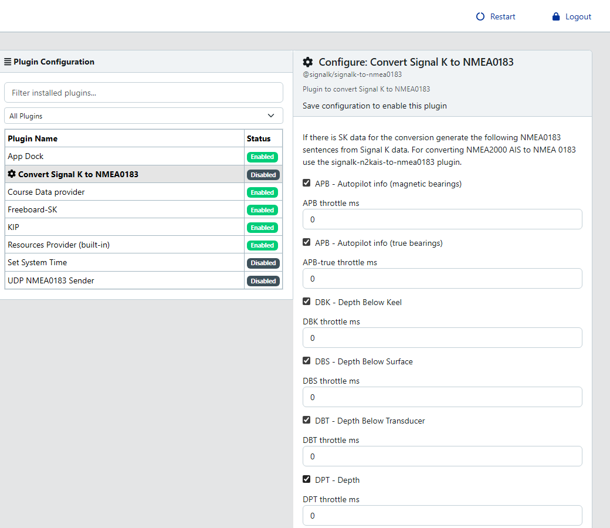

# signalk-to-nmea0183

[](https://github.com/SignalK/signalk-to-nmea0183/actions/workflows/ci.yml)
[](https://www.npmjs.com/package/@signalk/signalk-to-nmea0183)
[](https://github.com/SignalK/signalk-to-nmea0183/blob/master/LICENSE)

Signal K server plugin that converts Signal K deltas into NMEA 0183
sentences and publishes them on the server's TCP NMEA 0183 port
(`10110` by default). A per-sentence throttle lets you cap the emission
rate in milliseconds so downstream NMEA 0183 consumers don't get
flooded.

## Installation

Through the Signal K server admin UI — App Store → search for
_signalk-to-nmea0183_ → install. Or from the command line in your
`~/.signalk` dir:

```sh
npm install @signalk/signalk-to-nmea0183
```

Requires [signalk-server](https://github.com/SignalK/signalk-server)
with Node `>=22`.

> For **NMEA 2000 AIS → NMEA 0183** conversion use
> [`signalk-n2kais-to-nmea0183`](https://github.com/SignalK/signalk-n2kais-to-nmea0183)
> instead. This plugin does not emit AIS sentences.

## Usage

1. Enable the plugin in the server admin UI (_Server → Plugin Config →
   Convert Signal K to NMEA0183_) and tick the individual sentences you
   want emitted.
2. Connect any NMEA 0183 client (OpenCPN, kplex, netcat, ...) to
   `localhost:10110` — the server's built-in TCP NMEA 0183 server.



If the TCP server is off, enable it in _Server → Settings → Interfaces →
nmea-tcp_. No restart needed.

## Supported sentences

Each sentence is independently toggleable and has its own throttle
(ms). Leave the throttle at `0` to emit on every source update.

### Course and waypoints

- **APB** — autopilot info, magnetic bearings (`--true` variant also
  available)
- **RMB** — recommended minimum navigation info to waypoint
- **XTE** — cross-track error (`-GC` great-circle variant also available)

### Position, heading, speed

- **GLL** — geographic position, lat + lon
- **HDG / HDM / HDMC / HDT / HDTC** — heading variants (true /
  magnetic / deviation-corrected / magnetic-computed-from-true /
  true-computed-from-magnetic)
- **ROT** — rate of turn
- **RMC** — recommended minimum navigation data
- **VHW** — speed and heading through water
- **VTG** — track made good and speed over ground
- **VLW** — cumulative / trip log

### Depth

- **DBK / DBS / DBT** — depth below keel / surface / transducer
- **DPT** — depth + transducer offset (`-surface` variant references
  water surface)

### Wind

- **MWD** — true wind direction + speed (reference: north)
- **MWV** — apparent (`MWVR`) and true (`MWVT`) wind relative to the
  vessel
- **VWR / VWT** — legacy relative / true wind angle + speed
- **VPW** — speed parallel to wind

### Environment

- **MMB** — barometric pressure
- **MTA** — air temperature
- **MTW** — water temperature
- **XDRBaro / XDRTemp / XDRNA** — transducer readings for barometric
  pressure, air temperature, and pitch + roll (`XDRNA`)

### Rudder and time

- **RSA** — rudder sensor angle
- **GGA** — GPS fix data with time
- **ZDA** — UTC date/time and time-zone offset

### Proprietary

- **PNKEP01 / PNKEP02 / PNKEP03 / PNKEP99** — NKE Marine Electronics
  performance sentences: target polar speed, course on the other tack,
  polar speed + VMG + optimum angle, debug
- **PSILCD1** — polar speed + target wind angle for
  Silva / Nexus / Garmin displays
- **PSILTBS** — Garmin proprietary target boat speed

## Serial output

By default the converted NMEA 0183 stream is served on TCP port 10110
only. To push it out of a serial port instead, configure the serial
connection as an NMEA 0183 provider in the admin UI, then add a
`toStdout: "nmea0183out"` line to the provider's `subOptions` in
`settings.json`:

```json
{
  "pipedProviders": [
    {
      "id": "serial-out",
      "enabled": true,
      "pipeElements": [
        {
          "type": "providers/simple",
          "options": {
            "logging": false,
            "type": "NMEA0183",
            "subOptions": {
              "type": "serial",
              "device": "/dev/ttyUSB0",
              "baudrate": 4800,
              "providerId": "serial-out",
              "toStdout": "nmea0183out"
            },
            "providerId": "serial-out"
          }
        }
      ]
    }
  ]
}
```

The plugin emits each converted sentence as an internal event named
`nmea0183out`; `toStdout` wires that event stream into the serial
writer.

## Contributing

Issues and pull requests welcome at
[SignalK/signalk-to-nmea0183](https://github.com/SignalK/signalk-to-nmea0183).
`npm test` runs the full mocha suite; `npm run typecheck` +
`npm run build` guard the TypeScript surface; `npm run mutation` runs
Stryker against the encoders.

Adding a new sentence is a three-step change documented at the top of
[`src/sentences/index.ts`](src/sentences/index.ts): create a
`SentenceEncoderFactory`-shaped module under `src/sentences/`, import
it in the barrel, add tests under `test/`. `test/registry.ts` asserts
barrel-vs-directory parity so a missing import fails CI.

## License

Apache-2.0. See [LICENSE](LICENSE).
